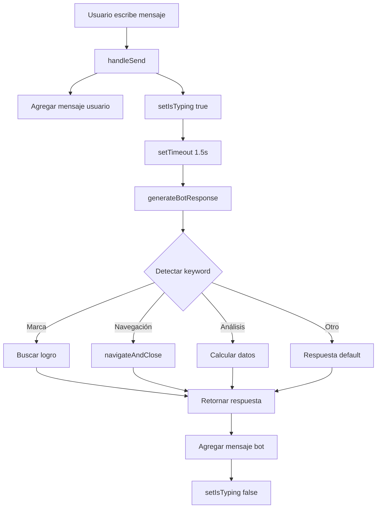

# 🤖 ChatBot Premium - Documentación Técnica

## 📋 Índice
1. [Descripción General](#descripción-general)
2. [Arquitectura](#arquitectura)
3. [Funcionalidades](#funcionalidades)
4. [Algoritmo de Respuestas](#algoritmo-de-respuestas)
5. [Navegación Inteligente](#navegación-inteligente)
6. [Análisis Financiero](#análisis-financiero)
7. [Integración](#integración)
8. [API Reference](#api-reference)

---

## 📖 Descripción General

El **ChatBot Premium** es un asistente financiero inteligente exclusivo para usuarios premium de Finaizen. Utiliza análisis de datos en tiempo real para proporcionar recomendaciones personalizadas, detectar patrones de gasto, y guiar al usuario mediante navegación automática.

### ✨ Características Principales
- 🧠 **Análisis financiero inteligente** en tiempo real
- 🔍 **Detección automática de logros** por marcas
- 🚀 **Navegación automática** a secciones relevantes
- 💾 **Historial persistente** en localStorage
- 📊 **Recomendaciones personalizadas** basadas en datos reales
- ⚡ **Respuestas en tiempo real** con indicador de escritura
- 🎯 **Acciones rápidas** predefinidas

---

## 🏗️ Arquitectura

### Componente Principal
```jsx
// Ubicación: src/components/ChatBot/ChatBot.jsx
export default function ChatBot({ isOpen, onClose })
```

### Dependencias
```javascript
import { useState, useRef, useEffect } from 'react';
import { useNavigate } from 'react-router-dom';
import { useAuth } from '../../context/AuthContext';
import mockDB from '../../utils/mockDatabase';
```

### Estado del Componente
```javascript
const [messages, setMessages] = useState([]);       // Array de mensajes
const [inputValue, setInputValue] = useState('');   // Input del usuario
const [isTyping, setIsTyping] = useState(false);    // Indicador de escritura
const messagesEndRef = useRef(null);                // Ref para auto-scroll
```

### Contexto Utilizado
- **useAuth()**: Obtiene `currentUser` y `currentPerfil`
- **useNavigate()**: Navegación programática a otras páginas
- **mockDB**: Base de datos para análisis financiero

---

## ⚙️ Funcionalidades

### 1. Persistencia de Historial

El ChatBot guarda el historial de conversación en `localStorage` usando la clave:
```javascript
`chatbot_${currentUser.id}`
```

**Carga inicial:**
```javascript
useEffect(() => {
  if (isOpen && currentUser) {
    const savedMessages = localStorage.getItem(`chatbot_${currentUser.id}`);
    if (savedMessages) {
      setMessages(JSON.parse(savedMessages));
    } else {
      // Mostrar mensaje de bienvenida
    }
  }
}, [isOpen, currentUser]);
```

**Guardado automático:**
```javascript
useEffect(() => {
  if (messages.length > 0 && currentUser) {
    localStorage.setItem(`chatbot_${currentUser.id}`, JSON.stringify(messages));
  }
}, [messages, currentUser]);
```

### 2. Auto-Scroll
```javascript
useEffect(() => {
  messagesEndRef.current?.scrollIntoView({ behavior: 'smooth' });
}, [messages]);
```

### 3. Envío de Mensajes
```javascript
const handleSend = () => {
  if (!inputValue.trim()) return;

  // 1. Agregar mensaje del usuario
  const userMessage = {
    id: Date.now(),
    type: 'user',
    text: inputValue,
    timestamp: new Date().toISOString()
  };
  setMessages(prev => [...prev, userMessage]);

  // 2. Limpiar input
  setInputValue('');

  // 3. Mostrar indicador de escritura
  setIsTyping(true);

  // 4. Generar respuesta después de 1.5s
  setTimeout(() => {
    const botResponse = generateBotResponse(inputValue);
    setMessages(prev => [...prev, {
      id: Date.now(),
      type: 'bot',
      text: botResponse,
      timestamp: new Date().toISOString()
    }]);
    setIsTyping(false);
  }, 1500);
};
```

### 4. Limpieza de Historial
```javascript
const clearHistory = () => {
  if (confirm('¿Estás seguro de que quieres borrar el historial de chat?')) {
    setMessages([{
      id: Date.now(),
      type: 'bot',
      text: `Historial limpiado. ¿En qué puedo ayudarte ${currentUser.nombre}?`,
      timestamp: new Date().toISOString()
    }]);
    localStorage.removeItem(`chatbot_${currentUser.id}`);
  }
};
```

---

## 🧠 Algoritmo de Respuestas

### Función Principal: `generateBotResponse(userInput)`

#### 1. Preparación de Datos
```javascript
const input = userInput.toLowerCase();  // Normalizar entrada

// Obtener datos financieros
const ingresos = mockDB.getIngresosDePerf(currentPerfil.id);
const egresos = mockDB.getEgresosDePerf(currentPerfil.id);
const logros = mockDB.getLogrosDePerfil(currentPerfil.id);

// Cálculos básicos
const totalIngresos = ingresos.reduce((sum, ing) => sum + ing.monto, 0);
const totalEgresos = egresos.reduce((sum, eg) => sum + eg.monto, 0);
const balance = totalIngresos - totalEgresos;

// Análisis de gastos por categoría
const gastosPorCategoria = {};
egresos.forEach(eg => {
  gastosPorCategoria[eg.categoria] = (gastosPorCategoria[eg.categoria] || 0) + eg.monto;
});

const categoriaConMasGastos = Object.entries(gastosPorCategoria)
  .sort((a, b) => b[1] - a[1])[0];
```

#### 2. Sistema de Detección por Palabras Clave

El ChatBot usa un sistema de **detección por inclusión de palabras clave** en el input del usuario:

```javascript
if (input.includes('keyword')) {
  // Generar respuesta específica
}
```

---

## 🚀 Navegación Inteligente

### Helper Function: `navigateAndClose()`
```javascript
const navigateAndClose = (path, delay = 2000) => {
  setTimeout(() => {
    navigate(path);  // Navegar a la ruta
    onClose();       // Cerrar el ChatBot
  }, delay);
};
```

### Detección de Marcas de Logros

**Diccionario de Marcas:**
```javascript
const marcasLogros = {
  'mcdonalds': 'McDonald\'s',
  'mcdonald': 'McDonald\'s',
  'kfc': 'KFC',
  'uber': 'Uber',
  'netflix': 'Netflix',
  'banco pichincha': 'Banco Pichincha',
  'pichincha': 'Banco Pichincha'
};
```

**Algoritmo de Búsqueda:**
```javascript
for (const [keyword, marcaNombre] of Object.entries(marcasLogros)) {
  if (input.includes(keyword)) {
    // Buscar logro relacionado
    const logroEncontrado = logros.find(l => 
      l.titulo && l.titulo.toLowerCase().includes(marcaNombre.toLowerCase())
    );
    
    if (logroEncontrado) {
      // Navegar automáticamente a /user/logros en 2 segundos
      navigateAndClose('/user/logros', 2000);
      
      // Generar respuesta con detalles del logro
      return `🎯 **Logro encontrado: ${logroEncontrado.titulo}**
      
${logroEncontrado.desbloqueado ? '✅ ¡Ya completaste este logro!' : '🔒 Aún no has desbloqueado este logro'}

🔄 **Te llevaré a la página de logros en 2 segundos...**`;
    }
  }
}
```

### Rutas de Navegación

| Palabra Clave | Ruta Destino | Delay |
|---------------|--------------|-------|
| `logro`, `insignia` | `/user/logros` | 2s |
| `historial`, `transacci` | `/user/historial` | 2s |
| `presupuesto` (sin "plan") | `/user/presupuestos` | 2s |
| `dashboard`, `inicio` | `/user/dashboard` | 2s |
| Marcas (McDonald's, KFC, etc.) | `/user/logros` | 2s |

---

## 📊 Análisis Financiero

### 1. Análisis General
**Keywords:** `analiz`, `resumen`, `estado`

```javascript
return `📊 **Análisis Financiero Actual:**

💰 **Balance General:**
• Ingresos totales: ${simbolo}${totalIngresos.toFixed(2)}
• Egresos totales: ${simbolo}${totalEgresos.toFixed(2)}
• Balance: ${simbolo}${balance.toFixed(2)} ${balance >= 0 ? '✅' : '⚠️'}

📈 **Categoría con más gastos:**
${categoriaConMasGastos[0]}: ${simbolo}${categoriaConMasGastos[1].toFixed(2)}

${balance < 0 ? '⚠️ Alerta' : '✅ Excelente'}`;
```

### 2. Estrategias de Ahorro
**Keywords:** `ahorr`, `guard`

**Algoritmo:**
```javascript
const potencialAhorro = totalIngresos * 0.2;  // 20% de ingresos

return `💡 **Estrategia de Ahorro Personalizada:**

🎯 **Meta de ahorro mensual:** ${simbolo}${potencialAhorro.toFixed(2)}

📝 **Recomendaciones:**
1. Automatiza transferencias
2. Regla 50/30/20
3. Revisa suscripciones
4. Reduce gastos en ${categoriaConMasGastos[0]}`;
```

### 3. Análisis de Gastos
**Keywords:** `gast`, `egres`

**Detección de Gastos Altos:**
```javascript
const promedioGastos = totalEgresos / egresos.length;
const gastosAltos = egresos.filter(e => e.monto > promedioGastos * 1.5);

// Gastos que superan el promedio en 50%
```

### 4. Análisis de Ingresos
**Keywords:** `ingres`, `entrada`

```javascript
const ingresosRecurrentes = ingresos.filter(i => i.esRecurrente);
const ingresosOcasionales = ingresos.filter(i => !i.esRecurrente);
```

### 5. Plan de Presupuesto (Regla 50/30/20)
**Keywords:** `presupuesto`, `plan`

```javascript
const necesidades = totalIngresos * 0.5;   // 50%
const gustos = totalIngresos * 0.3;        // 30%
const ahorros = totalIngresos * 0.2;       // 20%

return `📋 **Plan de Presupuesto Inteligente:**

🏠 **Necesidades (50%):** ${simbolo}${necesidades.toFixed(2)}
🎨 **Gustos (30%):** ${simbolo}${gustos.toFixed(2)}
💎 **Ahorros/Inversiones (20%):** ${simbolo}${ahorros.toFixed(2)}`;
```

### 6. Estrategias para Reducir Gastos
**Keywords:** `reduci`, `disminui`, `baj`

**Recomendaciones:**
1. Método del Desafío de 30 días
2. Auditar suscripciones
3. Planificar comidas
4. Regla de las 24 horas (compras >$50)
5. Reducir 20% en categoría dominante

---

## 🔌 Integración

### 1. Integración en DashboardUser

**Import:**
```javascript
import ChatBot from '../../components/ChatBot/ChatBot';
```

**Estado:**
```javascript
const [showChatBot, setShowChatBot] = useState(false);
```

**Renderizado:**
```jsx
{currentUser?.premiumActivo && (
  <ChatBot 
    isOpen={showChatBot} 
    onClose={() => setShowChatBot(false)} 
  />
)}
```

### 2. Integración en FloatingActionButton

**Menu Item para Premium:**
```javascript
const fabMenuItems = currentUser?.premiumActivo ? [
  {
    icon: '🤖',
    label: 'ChatBot IA Premium',
    action: () => setShowChatBot(true),  // Función custom
    isPremium: true
  },
  // ... otros items
] : [
  // Items para usuarios free
];
```

---

## 📚 API Reference

### Props del Componente

| Prop | Tipo | Requerido | Descripción |
|------|------|-----------|-------------|
| `isOpen` | `boolean` | Sí | Controla la visibilidad del ChatBot |
| `onClose` | `function` | Sí | Callback para cerrar el ChatBot |

### Métodos de mockDatabase Utilizados

| Método | Parámetros | Retorno | Descripción |
|--------|-----------|---------|-------------|
| `getIngresosDePerf(perfilId)` | `perfilId: number` | `Array<Ingreso>` | Obtiene todos los ingresos del perfil |
| `getEgresosDePerf(perfilId)` | `perfilId: number` | `Array<Egreso>` | Obtiene todos los egresos del perfil |
| `getLogrosDePerfil(perfilId)` | `perfilId: number` | `Array<Logro>` | Obtiene todos los logros del perfil |

### Hooks Utilizados

| Hook | Retorno | Descripción |
|------|---------|-------------|
| `useAuth()` | `{ currentUser, currentPerfil }` | Contexto de autenticación |
| `useNavigate()` | `navigate(path)` | Navegación programática |

### Estructura de Mensajes

```typescript
interface Message {
  id: number;                // Timestamp único
  type: 'user' | 'bot';      // Tipo de mensaje
  text: string;              // Contenido del mensaje
  timestamp: string;         // ISO string
}
```

---

## 🎨 Estilos (ChatBot.module.css)

### Clases Principales

| Clase | Descripción |
|-------|-------------|
| `.chatbotOverlay` | Overlay oscuro de fondo |
| `.chatbotContainer` | Contenedor principal del chat |
| `.header` | Cabecera con avatar y acciones |
| `.messagesContainer` | Área de mensajes con scroll |
| `.message.user` | Mensaje del usuario |
| `.message.bot` | Mensaje del bot |
| `.typingIndicator` | Animación de "escribiendo..." |
| `.inputContainer` | Contenedor del input |
| `.quickActions` | Botones de acciones rápidas |

### Animaciones

```css
@keyframes typing {
  0%, 100% { opacity: 0.3; }
  50% { opacity: 1; }
}

@keyframes slideUp {
  from {
    opacity: 0;
    transform: translateY(20px);
  }
  to {
    opacity: 1;
    transform: translateY(0);
  }
}
```

---

## 🧪 Ejemplos de Uso

### Ejemplo 1: Análisis Financiero
**Usuario escribe:** "Analiza mis finanzas"

**ChatBot responde:**
```
📊 Análisis Financiero Actual:

💰 Balance General:
• Ingresos totales: $3,500.00
• Egresos totales: $2,800.00
• Balance: $700.00 ✅

📈 Categoría con más gastos:
Alimentación: $800.00

✅ Excelente: Estás manteniendo un balance positivo. ¡Sigue así!
```

### Ejemplo 2: Búsqueda de Logro
**Usuario escribe:** "mcdonalds"

**ChatBot responde:**
```
🎯 Logro encontrado: McDonald's Fan

✅ ¡Ya completaste este logro!

📝 Descripción: Realiza 10 transacciones en McDonald's

🏆 Desbloqueado el: 15/11/2024

💡 Consejo: ¡Excelente! Sigue usando la app para desbloquear más logros.

🔄 Te llevaré a la página de logros en 2 segundos...
```

### Ejemplo 3: Estrategia de Ahorro
**Usuario escribe:** "Cómo ahorrar más"

**ChatBot responde:**
```
💡 Estrategia de Ahorro Personalizada:

Basándome en tus ingresos de $3,500.00, te recomiendo:

🎯 Meta de ahorro mensual: $700.00 (20% de tus ingresos)

📝 Recomendaciones:
1. Automatiza transferencias a una cuenta de ahorros
2. Usa la regla 50/30/20
3. Revisa suscripciones que no uses frecuentemente
4. Reduce gastos en Alimentación (actualmente: $800.00)

¿Quieres que te ayude a crear un plan de ahorro específico?
```

---

## 🐛 Manejo de Errores

### Validación de Datos

```javascript
// Validación de título de logro (evita TypeError)
const logroEncontrado = logros.find(l => 
  l.titulo && l.titulo.toLowerCase().includes(marcaNombre.toLowerCase())
);
```

### Protección contra Inputs Vacíos

```javascript
const handleSend = () => {
  if (!inputValue.trim()) return;  // No enviar si está vacío
  // ... resto del código
};
```

### Verificación de Usuario Premium

```javascript
if (!isOpen || !currentUser?.premiumActivo) return null;
```

---

## 🔄 Flujo de Ejecución



---

## 🚀 Mejoras Futuras

### Integración con API Real
```javascript
const generateBotResponse = async (userInput) => {
  try {
    const response = await fetch('/api/chatbot', {
      method: 'POST',
      headers: { 'Content-Type': 'application/json' },
      body: JSON.stringify({
        message: userInput,
        userId: currentUser.id,
        perfilId: currentPerfil.id,
        context: {
          ingresos: totalIngresos,
          egresos: totalEgresos,
          balance
        }
      })
    });
    
    const data = await response.json();
    return data.message;
  } catch (error) {
    return "Lo siento, hubo un error al procesar tu consulta.";
  }
};
```

### Posibles Integraciones
- **OpenAI GPT-4**: Respuestas más naturales
- **Google Gemini**: Análisis multimodal
- **Anthropic Claude**: Conversaciones contextuales
- **Hugging Face**: Modelos financieros especializados

### Funcionalidades Adicionales
1. **Exportar conversación** a PDF
2. **Compartir recomendaciones** por email
3. **Recordatorios inteligentes** basados en conversaciones
4. **Análisis de voz** para input
5. **Gráficas interactivas** dentro del chat
6. **Comparación con otros usuarios** (anónima)

---

## 📝 Changelog

### v1.2.0 (24/11/2024)
- ✅ Fix: Validación de `logro.titulo` para evitar TypeError
- ✅ Navegación automática funcional
- ✅ Detección de marcas operativa

### v1.1.0 (23/11/2024)
- ✅ Corrección de métodos mockDB (`getIngresosDePerf`, `getEgresosDePerf`)
- ✅ Implementación de navegación inteligente
- ✅ Detección de marcas de logros

### v1.0.0 (22/11/2024)
- ✅ Lanzamiento inicial
- ✅ Análisis financiero completo
- ✅ Historial persistente
- ✅ Acciones rápidas

---

## 📞 Soporte

Para reportar bugs o solicitar nuevas funcionalidades, contacta al equipo de desarrollo de Finaizen.

**Desarrollado con ❤️ para usuarios Premium de Finaizen**
