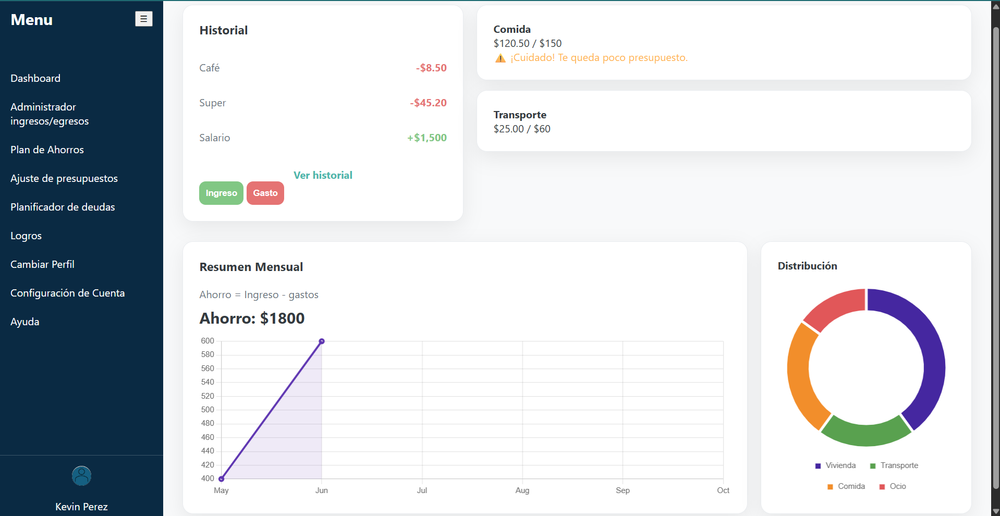
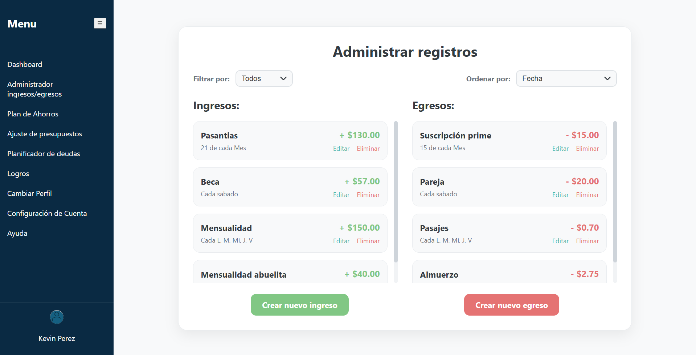
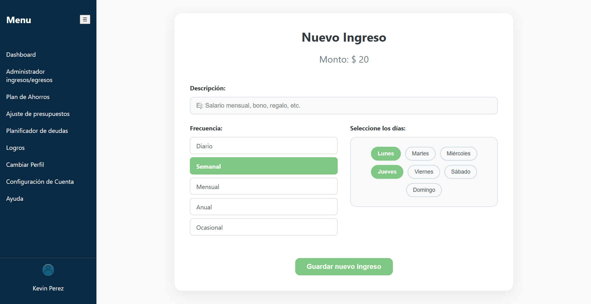
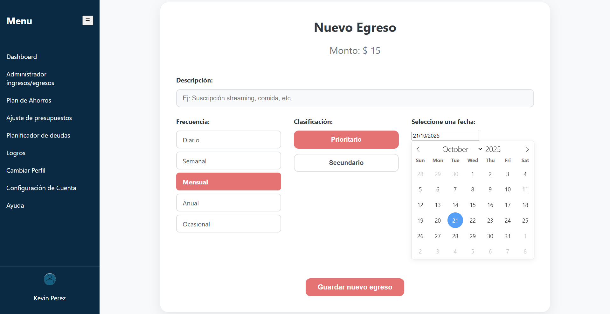
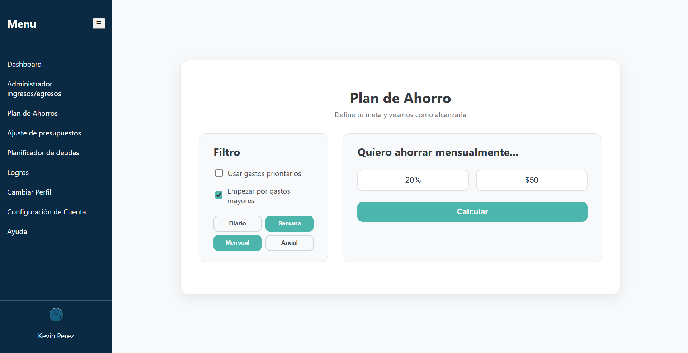
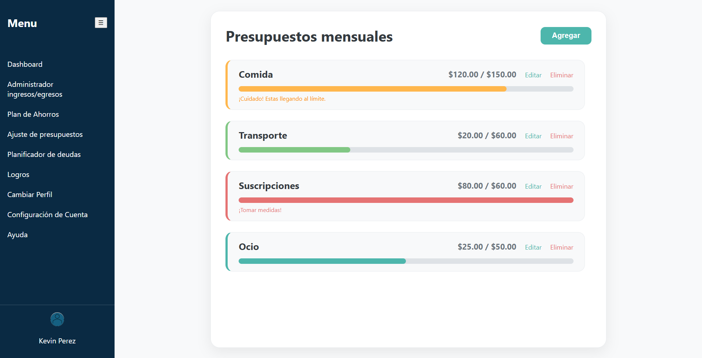

## ESCUELA POLITECNICA NACIONAL -  FACULTAD DE INGENIERIA ELECTRICA Y ELECTRONICA - APLICACIONES WEB Y MOVILES

# Informe 03
# Finaizen - Gestión Inteligente de Finanzas Personales

## Descripción Breve del objetivo de la práctica.
En la práctica se vieron los detalles sobre los primeros mockups para realizar la implementación en HTML y CSS.
En donde se compartieron los avances realizados, además de haber implementado de una vez una estructura de carpetas adecuadas para la organizacion de los distintos documentos (html, css y javascript).
Es importante mencionar que, contar con una organizacion adecuada de los archivos y contar con un estructura que permita el crecimiento de la aplicacion web y aplicar los cambios que sean necesarios.

## Conclusiones y recomendaciones
### Conclusiones
- La realización de los mockups en HTML y CSS permitió repasar las etiquetas con las que se trabaja en HTML y los selectores que se trabajan en CSS, como también explorar todas las propiedades y valores que se pueden configurar al establecer en los mockps todo el contenido y la estética visionada por parte del equipo. 
- La modularidad en este tipo de proyectos es esencial para mantener un orden y escalabilidad, por lo que se optó también ordenar por carpetas los diferentes mockups para los roles que pueden haber dentrode la aplicación. 

### Recomendaciones
- Se recomienda, por facilidad creativa y mejor rendimineto guiarse de una página existente para realizar los mockups.

## Capturas de las pantallas implementadas.
- Dashboard
  

- administrar registros
  
  
- nuevo ingreso
  
  
- nuevo egreso
  
  
- plan de ahorro
  
  
- presupuestos
  
